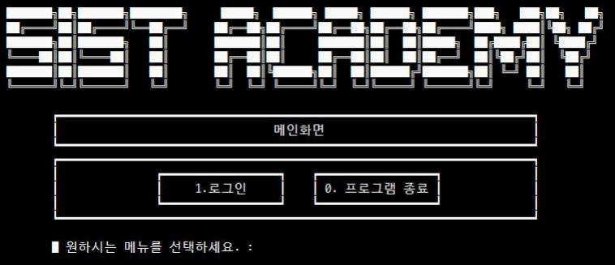

# 교육센터 운영 프로그램 SSacademy🏫

### SSacademy는 JDBC를 활용한 교육센터 운영 프로그램 입니다.

### 특징 Feature
+ 과정 및 과목 개설, 강의 일정 관리
+ 교사, 교육생 계정 등록 및 관리
+ 연계기업 채용공고 조회, 수료생 취업정보 조회

### 프로젝트 일정 Project Schedule

### 개발 환경 Develop Environment

### 개발 팀원 Project Member
+ __김주혁__
+ 김다은
+ 박지현
+ 임채원
+ 조성진
+ 조혜승

### 데이터 구조 Data Structure

### 담당 업무 구현 Development

### 후기 Comment
> 데이터베이스를 사용한 첫 프로젝트인 만큼 ERD 작성 시 관계 형성 및 정규화 작업에 미숙한 부분이 많았고, 팀원들과 지속적으로 커뮤니케이션하면서 컬럼명 수정부터 테이블 추가/삭제까지 많은 수정을 했습니다.   
DML, 서브 쿼리, 조인, 뷰를 사용하면서 많이 숙달되었고, PL/SQL도 사용하여 작업했습니다.   
교육센터에서 진행한 두 번째 프로젝트인데 이때부터 Git을 사용했습니다. 처음 사용할 땐 충돌 나는 경우가 생겨 고생했지만, 프로젝트는 이상 없이 마무리했습니다. 기업에서 Git으로 협업하는 경우가 대부분이라고 하는데 조금 더 빨리 Git을 접했으면 좋았겠다고 생각했습니다.
